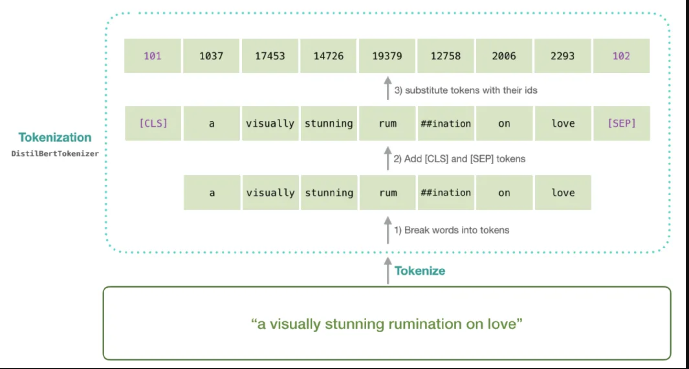

# bert-based-classify-text
Repo to learn and apply different methods to train and host BERT based classification

## Goal
Build a basic text classification model using any framework(PyTorch, Keras, etc..) and deploy via a REST API

## API Requirements
- Serve the model as a REST API using FastAPI
- Be able to use CURL to send in text input and return the prediction.

## Data
The dataset you will be using contains hate speech from an online forum. You need to train basic text classification model which will classify given text into `hate` `noHate` categories. You can find the dataset and details data format and labels can be found [here](https://github.com/Vicomtech/hate-speech-dataset/tree/master)

Dataset contains two splits `sampled_train` and `sampled_test`.

Note: The text in this dataset might contain offensive language.


## inspiration from [blog](https://towardsdatascience.com/hugging-face-transformers-fine-tuning-distilbert-for-binary-classification-tasks-490f1d192379)

### Data processing
* DATASET is already balanced so no need for Over/Under sampling `--> Note to do`

### Transfer learning using HF
1. Tokenizing Text
2. Defining a Model Architecture
3. Training Classification Layer Weights
4. Fine-tuning DistilBERT and Training All Weights*

    #### 1. Tokenizing Text
    Hugging Face API makes it extremely easy to convert words and sentences → sequences of tokens → sequences of numbers that can be converted into a tensor and fed into our model.
    
    <i>BERT and DistilBERT tokenization process. The special [CLS] token stands for ‘classification’ and will contain an embedding for the sentence-level representation of the sequence. The special [SEP] token stands for ‘separation’ and is used to demarcate boundaries between sequences.</i>


## How to Run this app?
`docker run -d -p 8000:8000 hate-speech-detection-api:latest`

or 
```bash
git clone `repo name`
cd `repo name`
conda create -n `*env name*` python==3.10
conda activate `*env name*`
pip install -r requirements.txt
uvicorn app:app --reload
```
    