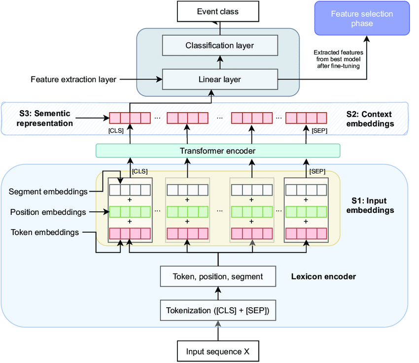
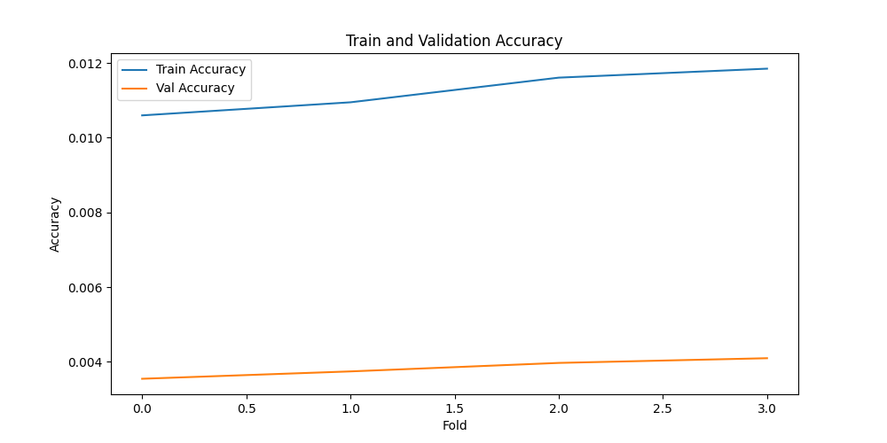
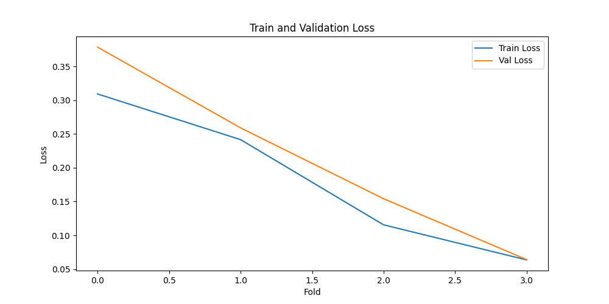
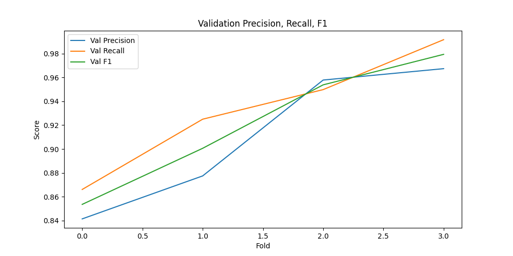
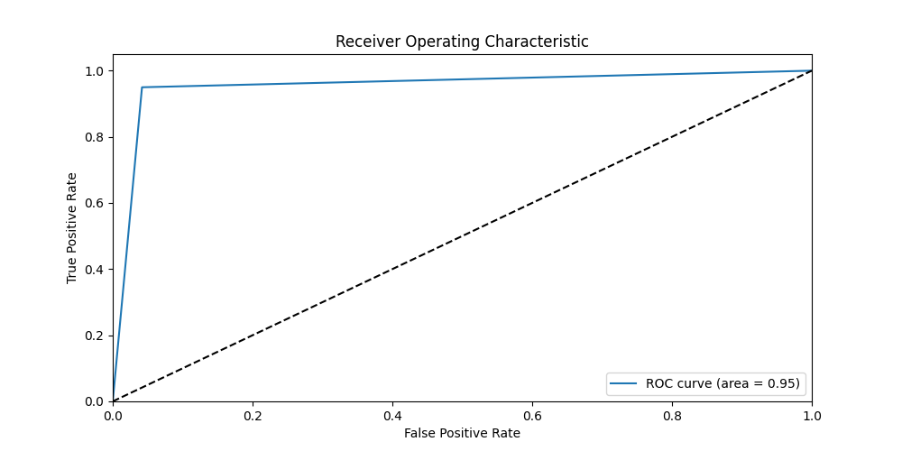

# bert-based-classify-text
Repo to learn and apply different methods to train and host BERT based classification

## Goal
Build a basic text classification model using any framework(PyTorch, Keras, etc..) and deploy via a REST API

## API Requirements
- Serve the model as a REST API using FastAPI
- Be able to use CURL to send in text input and return the prediction.

## Data
The dataset you will be using contains hate speech from an online forum. You need to train basic text classification model which will classify given text into `hate` `noHate` categories. You can find the dataset and details data format and labels can be found [here](https://github.com/Vicomtech/hate-speech-dataset/tree/master)

Dataset contains two splits `sampled_train` and `sampled_test`.

Note: The text in this dataset might contain offensive language.


## inspiration from [blog](https://towardsdatascience.com/hugging-face-transformers-fine-tuning-distilbert-for-binary-classification-tasks-490f1d192379)

### Target Architecture

NOTE: Ignore Feature selection phase on top right corner


### Data processing
* DATASET is already balanced so no need for Over/Under sampling `--> Note to do`

### Transfer learning using HF
1. Tokenizing Text
2. Defining a Model Architecture
3. Training Classification Layer Weights
4. Fine-tuning DistilBERT and Training All Weights*

    #### 1. Tokenizing Text
    Hugging Face API makes it extremely easy to convert words and sentences → sequences of tokens → sequences of numbers that can be converted into a tensor and fed into our model.
    
    <i>BERT and DistilBERT tokenization process. The special [CLS] token stands for ‘classification’ and will contain an embedding for the sentence-level representation of the sequence. The special [SEP] token stands for ‘separation’ and is used to demarcate boundaries between sequences.</i>


## How to Run this app?
`docker run -d -p 8000:8000 hate-speech-detection-api:latest`

or 

```bash
git clone `repo name`
cd `repo name`
conda create -n `*env name*` python==3.10
conda activate `*env name*`
pip install -r requirements.txt
uvicorn app:app --reload
```

TO DO:
1. Handle for unbalanced dataset
1.1. Either use different loss function like Focal  loss
1.2. Use Undersampling / Oversampling (generation) - tricky
2. Train on different model of BeRT family
3. Train for larger context window - check limitation of 524 length for BERT
4. Custom Classifier other than pytorch 2 layer Dense neural network - Architecture change.

### Experiments Results while Training
```
Fold: 1
INFO:root:Epoch 1/2, Train Loss: 0.5536, Train Acc: 0.0087, Val Loss: 0.4072, Val Acc: 0.0034
INFO:root:Epoch 2/2, Train Loss: 0.3092, Train Acc: 0.0106, Val Loss: 0.3785, Val Acc: 0.0035
INFO:root:Confusion Matrix: 
 [[201  39]
 [ 32 207]]
INFO:root:ROC-AUC Score: 0.8518043933054393
Fold: 2
INFO:root:Epoch 1/2, Train Loss: 0.3845, Train Acc: 0.0100, Val Loss: 0.2894, Val Acc: 0.0038
INFO:root:Epoch 2/2, Train Loss: 0.2416, Train Acc: 0.0109, Val Loss: 0.2590, Val Acc: 0.0037
INFO:root:Confusion Matrix: 
 [[208  31]
 [ 18 222]]
INFO:root:ROC-AUC Score: 0.8976464435146444
Fold: 3
INFO:root:Epoch 1/2, Train Loss: 0.2593, Train Acc: 0.0108, Val Loss: 0.1619, Val Acc: 0.0040
INFO:root:Epoch 2/2, Train Loss: 0.1155, Train Acc: 0.0116, Val Loss: 0.1541, Val Acc: 0.0040
INFO:root:Confusion Matrix: 
 [[229  10]
 [ 12 227]]
INFO:root:ROC-AUC Score: 0.9539748953974896
Fold: 4
INFO:root:Epoch 1/2, Train Loss: 0.1416, Train Acc: 0.0114, Val Loss: 0.0628, Val Acc: 0.0041
INFO:root:Epoch 2/2, Train Loss: 0.0636, Train Acc: 0.0118, Val Loss: 0.0640, Val Acc: 0.0041
INFO:root:Confusion Matrix: 
 [[231   8]
 [  2 237]]
INFO:root:ROC-AUC Score: 0.9790794979079499

INFO:root:Average Metrics Across Folds:
INFO:root:Train Loss: 0.1825, Train Accuracy: 0.0113
INFO:root:Val Loss: 0.2139, Val Accuracy: 0.0038, Val Precision: 0.9110, Val Recall: 0.9331, Val F1: 0.9218
INFO:root:Best Fold: 3
INFO:root:Best Model: ./models/fold3_model.pt
```
#### Accuracy and Loss Plot for folds
 

### Validation Precision Recall and F1 curve

### ROC curve for best fold: 3


------------------

## Link to presentation to explain this problem and techniques
DHL-sharing deck - [[PPTX](./material4gh/DHL-sharing%20deck.pptx) , [PDF](./material4gh/DHL-sharing%20deck.pdf)]

-------
